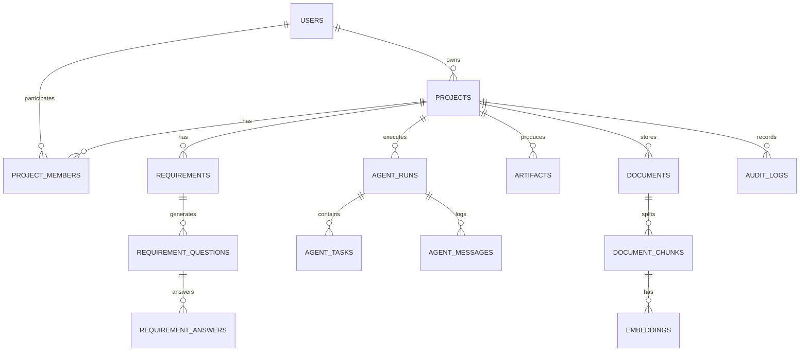

# ArchAI Database Design & Data Architecture

## 1. Overview
ArchAI utilizes a relational schema built with **PostgreSQL 16** with the **pgvector** extension for vector embeddings. The schema uses UUID primary keys, UTC timestamp tracking, JSONB columns for flexible agent outputs, and foreign key relations.

For zero-dependency environments, testing suites, and immediate out-of-the-box local developer startup, ArchAI supports SQLite with an in-memory cosine-similarity vector index fallback.

## 2. Entity-Relationship Overview

## 3. Database Tables Specification

### Core Identity & Access Control
- `users`: ID (UUID PK), email (Unique), hashed_password, full_name, role (guest, user, admin), is_active, created_at, updated_at.
- `roles`: ID (UUID PK), name (Unique), description, permissions (JSONB).
- `project_members`: ID (UUID PK), project_id (FK), user_id (FK), role (owner, editor, viewer), created_at.

### Project & Requirements
- `projects`: ID (UUID PK), owner_id (FK), name, description, industry, target_users, business_objective, scale_tier, tech_preferences, status (DRAFT, ANALYZING, QUESTIONS_PENDING, FINALIZING, ORCHESTRATING, COMPLETED, FAILED), created_at, updated_at.
- `requirements`: ID (UUID PK), project_id (FK), raw_input, project_summary, business_goals (JSONB), actors (JSONB), functional_requirements (JSONB), non_functional_requirements (JSONB), constraints (JSONB), assumptions (JSONB), risks (JSONB), is_finalized, finalized_srs (Text/JSONB), created_at, updated_at.
- `requirement_questions`: ID (UUID PK), requirement_id (FK), question_key, question_text, category, options (JSONB), priority, created_at.
- `requirement_answers`: ID (UUID PK), question_id (FK), selected_option, custom_text, created_at.

### Multi-Agent Orchestration & Execution
- `agents`: ID (UUID PK), agent_key (String unique), name, role_title, system_prompt_path, version, is_active.
- `agent_runs`: ID (UUID PK), project_id (FK), orchestrator_status (PENDING, RUNNING, COMPLETED, FAILED, CANCELLED), stage, total_tokens, execution_duration_ms, error_message, started_at, completed_at.
- `agent_tasks`: ID (UUID PK), agent_run_id (FK), agent_key, status (QUEUED, RUNNING, COMPLETED, FAILED, RETRYING), retry_count, token_usage, duration_ms, input_payload (JSONB), output_payload (JSONB), error_log, started_at, completed_at.
- `agent_messages`: ID (UUID PK), agent_run_id (FK), agent_key, message_type (STATUS, LOG, WARNING, ERROR), content, timestamp.

### Deliverables & Artifacts
- `artifacts`: ID (UUID PK), project_id (FK), agent_run_id (FK nullable), artifact_type (SRS, ROADMAP, ARCHITECTURE, ERD, SQL, API_SPEC, UI_FLOW, SECURITY_REPORT, TEST_PLAN, DEPLOYMENT_PLAN, TECHNICAL_DOC, USER_MANUAL, ADR, CONSISTENCY_REPORT), title, version (Int), content (Text/JSONB), status (DRAFT, REVIEW, APPROVED, REJECTED), created_by (FK), created_at, updated_at.
- `architecture_decisions`: ID (UUID PK), project_id (FK), adr_number, title, context, decision, consequences, status.
- `api_specs`: ID (UUID PK), project_id (FK), spec_format (OPENAPI_3_1), openapi_json (JSONB), endpoints_count.
- `database_schemas`: ID (UUID PK), project_id (FK), dialect (POSTGRESQL), ddl_script, entities (JSONB), relationships (JSONB).
- `test_cases`: ID (UUID PK), project_id (FK), test_suite, category, title, steps (JSONB), expected_result.
- `security_reports`: ID (UUID PK), project_id (FK), threat_model (JSONB), owasp_matrix (JSONB), mitigations (JSONB), risk_score.
- `deployment_plans`: ID (UUID PK), project_id (FK), cloud_provider, docker_compose_yaml, cicd_pipeline_yaml, cost_breakdown (JSONB).

### RAG & Document Knowledge
- `documents`: ID (UUID PK), project_id (FK), filename, file_type (PDF, MD, TXT, DOCX), file_size, storage_path, processed, created_at.
- `document_chunks`: ID (UUID PK), document_id (FK), chunk_index, text_content, token_count, metadata_json (JSONB).
- `embeddings`: ID (UUID PK), chunk_id (FK), embedding_vector (vector(768) / JSONB for sqlite), model_name.

### Observability & Telemetry
- `notifications`: ID (UUID PK), user_id (FK), title, message, type, is_read, created_at.
- `audit_logs`: ID (UUID PK), user_id (FK nullable), project_id (FK nullable), action, entity_type, entity_id, ip_address, details (JSONB), created_at.
- `usage_records`: ID (UUID PK), project_id (FK), user_id (FK), model_name, prompt_tokens, completion_tokens, estimated_cost_usd, timestamp.
