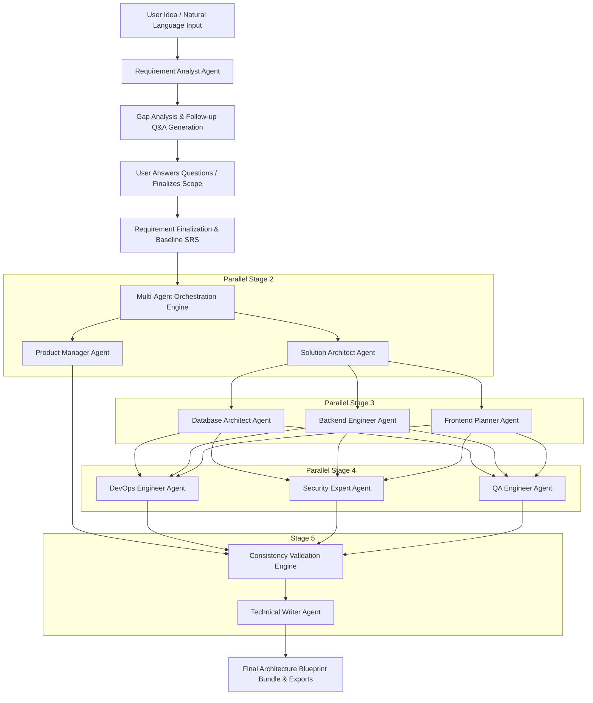

# ArchAI Master Plan

## 1. Executive Summary
**ArchAI** is an enterprise-grade AI Software Solution Architect platform designed to automate and augment the end-to-end software architecture lifecycle. Given a natural-language concept or high-level business requirement, ArchAI coordinates a specialized multi-agent AI system to conduct requirement analysis, resolve ambiguities via targeted follow-up questions, establish an unambiguous Software Requirements Specification (SRS), and concurrently synthesize detailed architectural blueprints across domain boundaries.

## 2. Core Value Proposition
- **From Idea to Architecture in Minutes**: Accelerate months of preliminary architecture spikes into minutes of structured, validated engineering artifacts.
- **Multi-Agent Domain Specialization**: 10 specialized agent personas covering Requirement Analysis, Product Management, Solution Architecture, Database Architecture, Backend Engineering, Frontend Planning, DevOps, Security, QA, and Technical Documentation.
- **Strict Architectural Validation**: Built-in validation engine detects contradictions, security gaps, technology mismatches, and requirement drift across all deliverables.
- **Actionable, Production-Ready Deliverables**: High-fidelity system architecture diagrams, relational schemas, DDL scripts, OpenAPI 3.1 specifications, threat models, CI/CD pipelines, and cost estimations.
- **Hybrid RAG & Knowledge Grounding**: Ground decisions in enterprise architecture standards, compliance frameworks, and organizational patterns with source citations.

## 3. Product Lifecycle Workflow

## 4. Phase-by-Phase Roadmap
1. **Phase 1: Foundation & Architecture Design**: Establish domain models, agent contracts, RAG interfaces, and documentation.
2. **Phase 2: Backend Architecture & AI Core**: Implement FastAPI backend, SQLAlchemy database schema, LLM provider abstraction (Gemini + Demo mode), and Vector RAG.
3. **Phase 3: 10 Specialized Agents & Graph Orchestrator**: Implement typed Pydantic contracts, prompt templates, tool execution layer, and dependency-aware orchestrator.
4. **Phase 4: Frontend Workspace & Interactive Visualizers**: Build responsive Next.js/Tailwind web app with dark theme, live agent tracking, interactive diagrams, ERD visualizers, and artifact editors.
5. **Phase 5: Observability, Export & Security Engine**: Integrate audit logging, token telemetry, OWASP validation, and multi-format exports (Markdown, JSON, SQL, OpenAPI, ZIP).
6. **Phase 6: Quality Assurance, Seed Data & Verification**: Comprehensive unit/integration/E2E test suites, browser automation verification, and Dockerized deployment.
